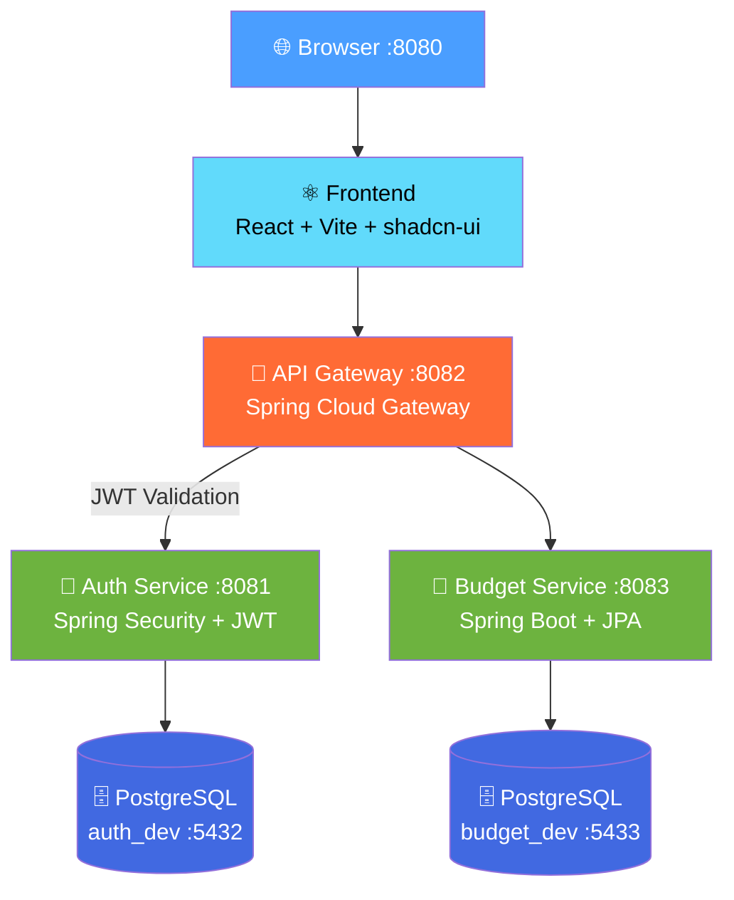

<div align="center">

# 💰 Budget Invest Bloom

**Платформа управления личными финансами**

[](https://openjdk.org/)
[](https://spring.io/projects/spring-boot)
[](https://react.dev/)
[](https://www.typescriptlang.org/)
[](https://www.postgresql.org/)
[](https://docs.docker.com/compose/)

</div>

---

Fullstack-приложение на микросервисной архитектуре для учёта расходов, бюджетирования и аналитики личных финансов. Backend на Java 24 + Spring Boot 3, фронтенд на React 18 + TypeScript, API Gateway с JWT-авторизацией, всё запускается одной командой через Docker Compose.

## 🏗️ Архитектура



## 🛠️ Стек технологий

| Слой | Технологии |
|------|-----------|
| **Backend** | Java 24, Spring Boot 3, Spring Security, Spring Cloud Gateway, Spring Data JPA, Liquibase, JWT (JJWT), MapStruct, Lombok |
| **Frontend** | React 18, TypeScript, Vite, shadcn-ui (Radix UI), Tailwind CSS, TanStack Query, React Router, React Hook Form, Zod, Recharts |
| **Базы данных** | PostgreSQL 15 (2 изолированных инстанса) |
| **Инфраструктура** | Docker, Docker Compose, Testcontainers |
| **Документация** | SpringDoc OpenAPI (Swagger UI) |

## 📁 Структура проекта

```
budget-invest-bloom-monorepo/
├── auth/                    # Сервис аутентификации (JWT, refresh tokens)
├── budget/                  # Сервис управления бюджетом
├── gateway/                 # API Gateway (маршрутизация + валидация токенов)
├── budget-invest-bloom/     # React SPA (фронтенд)
├── docs/                    # Документация API-контрактов
└── docker-compose.yml       # Оркестрация всех сервисов
```

## 🚀 Быстрый старт

```bash
# Клонировать репозиторий
git clone https://github.com/lopatuxin/budget-invest-bloom-monorepo.git
cd budget-invest-bloom-monorepo

# Запустить всё одной командой
docker compose up
```

Приложение будет доступно:

| Сервис | URL | Описание |
|--------|-----|----------|
| Frontend | http://localhost:8080 | Веб-интерфейс |
| Gateway | http://localhost:8082 | API Gateway |
| Auth API | http://localhost:8081 | Аутентификация |
| Budget API | http://localhost:8083 | Управление бюджетом |

## 🔐 Аутентификация

- **Access Token** — JWT, время жизни 15 минут
- **Refresh Token** — время жизни 7 дней
- Валидация токенов на уровне Gateway через общий JWT-секрет с Auth-сервисом

## 📡 API

Все сервисы используют унифицированный контракт запросов и ответов.

**Формат ответа:**
```json
{
  "id": "uuid",
  "status": 200,
  "message": "Операция выполнена успешно",
  "timestamp": "2026-04-06T12:00:00Z",
  "body": { }
}
```

Подробная документация: [`docs/standartRequestAndResponse.md`](docs/standartRequestAndResponse.md)

---

<div align="center">
  <sub>Разработано с ☕ и Spring Boot</sub>
</div>
