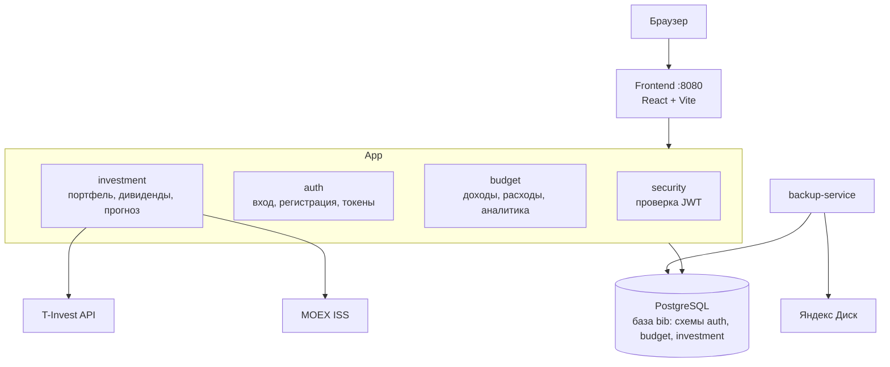

<div align="center">

# Budget Invest Bloom

**Личное приложение для учёта денег: бюджет, инвестиции и прогноз**

[](https://openjdk.org/)
[](https://spring.io/projects/spring-boot)
[](https://react.dev/)
[](https://www.typescriptlang.org/)
[](https://www.postgresql.org/)
[](https://docs.docker.com/compose/)

</div>

---

Доходы и расходы по категориям, сравнение месяца с обычной нормой и года с прошлым годом, инвестиционный портфель с котировками Московской биржи и дивидендами из T-Invest, прогноз капитала. Сервер — один процесс на Java 24 и Spring Boot 4, собранный из независимых модулей. Клиент — React 18 и TypeScript. Всё запускается через Docker Compose.

## Архитектура


```mermaid
graph TB
    Browser[Браузер] --> Frontend[Frontend :8080<br/>React + Vite]
    Frontend --> App[App :8082<br/>Spring Boot]
    subgraph App
        Security[security<br/>проверка JWT]
        Auth[auth<br/>вход, регистрация, токены]
        Budget[budget<br/>доходы, расходы, аналитика]
        Investment[investment<br/>портфель, дивиденды, прогноз]
    end
    App --> DB[(PostgreSQL<br/>база bib: схемы auth, budget, investment)]
    Investment --> MOEX[MOEX ISS]
    Investment --> TInvest[T-Invest API]
    Backup[backup-service] --> DB
    Backup --> YaDisk[Яндекс Диск]
```

- **security** проверяет токен у каждого запроса и подставляет пользователя в тело запроса. Остальные модули токены не разбирают.
- **auth**, **budget** и **investment** друг от друга не зависят. Когда сделка с бумагой должна попасть в бюджет, `investment` вызывает интерфейс из `shared`, а реализует его `budget`.
- У каждого модуля своя схема в общей базе `bib` и свои миграции Liquibase.
- **backup-service** раз в сутки после 21:00 делает дамп базы на Яндекс Диск и раз в неделю проверяет, что дамп восстанавливается.

## Стек

| Слой | Технологии |
|------|-----------|
| **Сервер** | Java 24, Spring Boot 4, Spring Security, Spring Data JPA, Liquibase, JJWT, MapStruct, Lombok, Caffeine, Resilience4j |
| **Клиент** | React 18, TypeScript, Vite, Tailwind CSS, shadcn/ui, TanStack Query, React Router, React Hook Form, Zod, Recharts |
| **База** | PostgreSQL 15 |
| **Инфраструктура** | Docker Compose, Testcontainers, rclone, Sentry |

## Структура

```
budget-invest-bloom-monorepo/
├── app/                   # Сборка всех модулей в одно приложение, настройки базы и миграций
├── shared/                # Общий формат запросов и ответов, интерфейсы между модулями
├── security/              # Проверка JWT, CORS, пользователь из токена
├── auth/                  # Вход, регистрация, refresh-токены, блокировка после неудачных попыток
├── budget/                # Доходы, расходы, категории, аналитика, капитал
├── investment/            # Сделки, позиции, котировки, дивиденды, прогноз
├── budget-invest-bloom/   # Клиент на React
├── scripts/backup/        # Резервное копирование на Яндекс Диск
└── docker-compose.yml     # postgres, app, frontend, backup-service
```

## Запуск

1. Скопировать `.env.example` в `.env` и заполнить обязательные значения: `BIB_POSTGRES_PASSWORD`, `JWT_SECRET`, `AUTH_REFRESH_TOKEN_PEPPER`. Для резервных копий нужен `YADISK_OAUTH_TOKEN`, для дивидендов — `TINVEST_TOKEN`.
2. Поднять стенд:

```
docker compose up -d --build
```

| Что | Адрес |
|-----|-------|
| Приложение | http://localhost:8080 |
| API | http://localhost:8082 |
| Swagger UI | http://localhost:8082/swagger-ui/index.html |

Клиент в контейнере работает как dev-сервер Vite с подключёнными исходниками, поэтому правки в `budget-invest-bloom/src` видны сразу. После изменения `package.json` контейнер пересоздаётся с новым томом зависимостей:

```
docker compose up -d --build --force-recreate --renew-anon-volumes frontend
```

## Проверка

```
./gradlew build
```

Собирает все модули и прогоняет тесты. Тесты поднимают PostgreSQL через Testcontainers, поэтому нужен запущенный Docker.

```
cd budget-invest-bloom
npm run build
npm run lint
```

## Вход и токены

- Access-токен — JWT на 15 минут, передаётся в заголовке `Authorization`.
- Refresh-токен — на 90 дней, лежит в HttpOnly-cookie. В базе хранится только его хеш. Повторное использование старого refresh-токена считается кражей и завершает все сессии.
- После пяти неверных паролей подряд вход закрывается на 15 минут.

## Формат API

Запросы, включая чтение, идут методом `POST` с телом `{ "data": { ... } }`; исключение — `GET /api/investment/market/securities`. Ответ:

```json
{
  "id": "uuid",
  "status": 200,
  "message": "Операция выполнена успешно",
  "timestamp": "2026-09-13T12:00:00Z",
  "body": { }
}
```

Код ошибки, по которому клиент выбирает текст, приходит в `body.code`, например `INVALID_CREDENTIALS` или `CATEGORY_NAME_TAKEN`.
